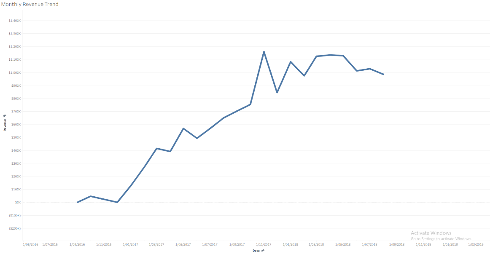
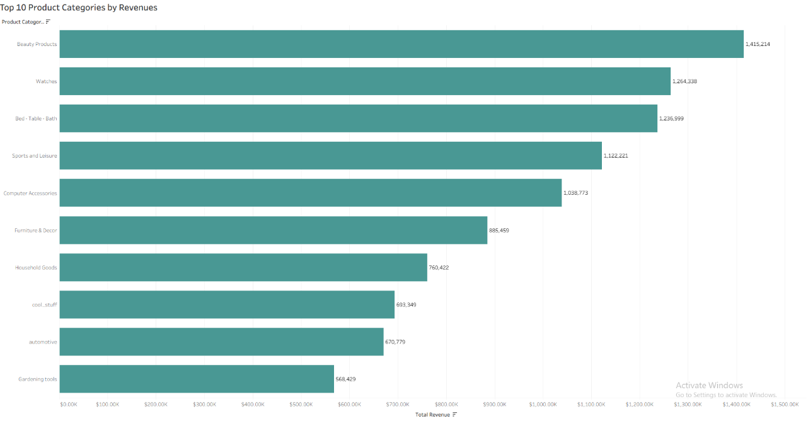
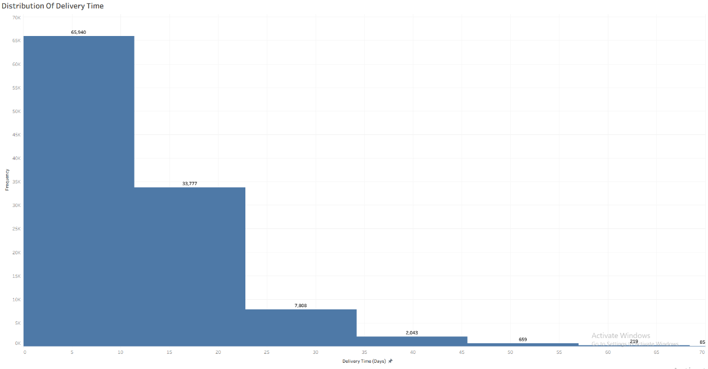
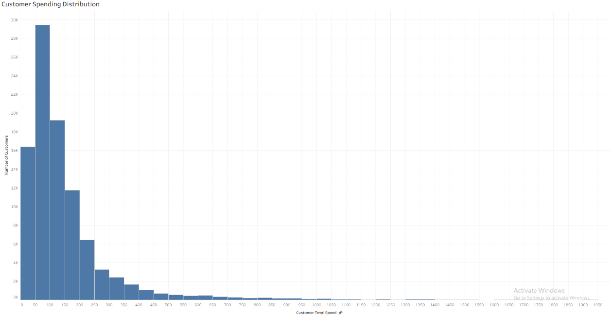

📊 E-commerce Data Analysis Project
📌 Overview

This project analyzes a Brazilian e-commerce dataset to uncover insights related to sales performance, customer behavior, and delivery efficiency. The goal is to simulate a real-world data analyst role by transforming raw data into actionable business insights.

🛠 Tools & Technologies
Python (Pandas, NumPy)
SQL
Seaborn & Matplotlib
Power BI
📂 Dataset

The dataset includes:

Customers
Orders & Transactions
Products
Sellers

👉 Dataset source:
https://www.kaggle.com/datasets/olistbr/brazilian-ecommerce

🔍 Key Analysis
Sales trends over time
Customer segmentation
Delivery performance and delays
Revenue distribution across sellers
📈 Key Insights
Revenue transitioned from rapid growth to a more mature phase
Sales are concentrated in a small number of product categories
Delivery performance directly impacts customer satisfaction
A small group of customers drives a large portion of revenue
💡 Business Recommendations
Optimize last-mile delivery operations in high-delay regions
Focus on high-value customer retention strategies
Prioritize top-performing product categories
Monitor KPIs for delivery and customer satisfaction
📊 Visualizations

(Add these under it 👇)

📊 Presentation

👉 [View Full Presentation](Brazilian-ecommerce Data Analysis Project - Renzo Alarcon.pdf)
